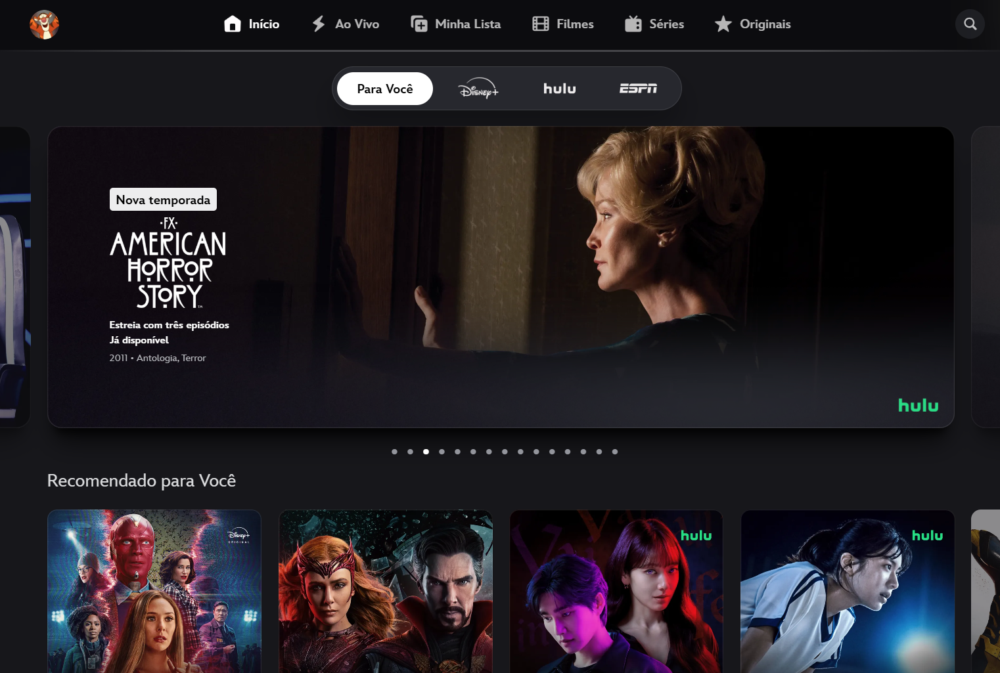
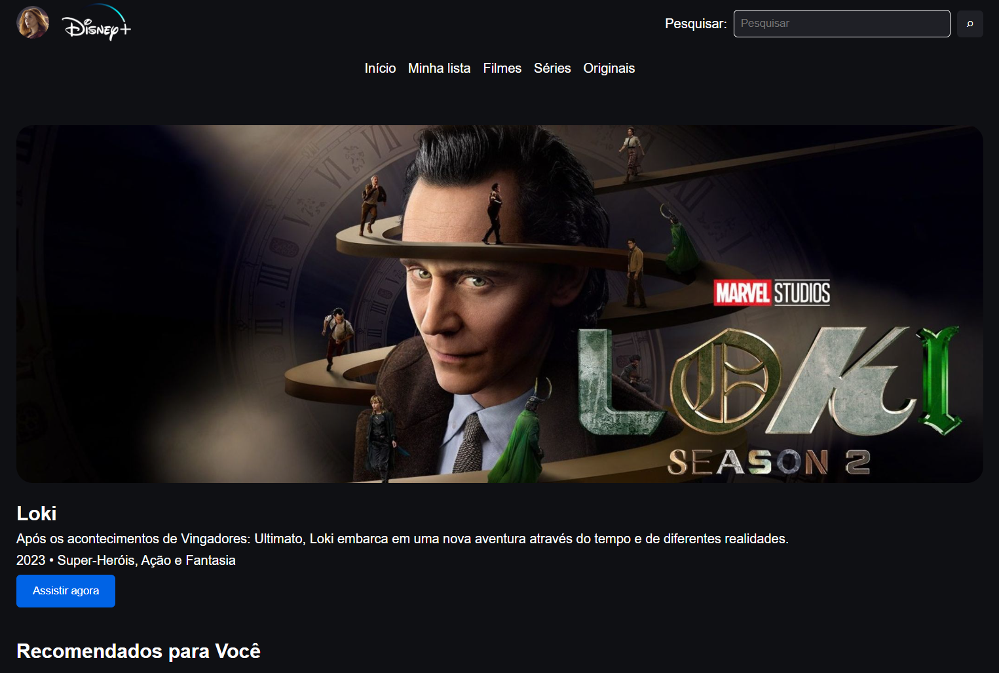
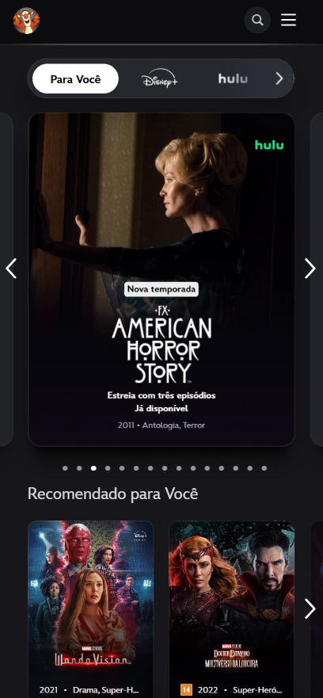
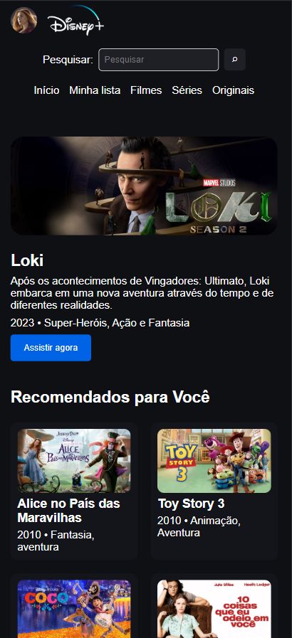

# Disney+ - Projeto Página Web de Front-End

## Informações Acadêmicas

**Nome:** Isadora Severo Sacomori
**RA:** 1139246

## Sobre o projeto

Este projeto foi desenvolvido para a disciplina de Front-End e consiste na recriação de uma página web já existente, neste caso, a escolhida foi a página inicial do Disney+. O objetivo é utilizar os conhecimentos de HTML e CSS vistos durante as aulas de Front-End para reproduzir a organização e as principais características visuais de um site real.
A página desenvolvida é uma versão simplificada do Disney+, contendo cabeçalho com menu de navegação e pesquisa, banner de destaque, recomendações de filmes, categorias, informações sobre o projeto e rodapé.

## Site utilizado como referência

O site utilizado como referência foi o Disney+, especificamente a página Home.

**Link:** https://www.disneyplus.com/

---

# Parte 1 - Construção da Página Web

## 1.1 - Estrutura semântica e acessibilidade

- [x] Requisito cumprido

A estrutura da página foi desenvolvida utilizando elementos semânticos do HTML, buscando organizar o conteúdo de acordo com sua função. O elemento 'header' foi utilizado para representar o cabeçalho da página, enquanto o 'nav' foi utilizado para organizar os elementos de navegação.
O conteúdo principal da página está dentro do elemento 'main', sendo dividido em diferentes 'section' para separar as principais áreas do site. Os conteúdos individuais de filmes e séries são organizados utilizando 'article'. As imagens utilizadas na página possuem o atributo 'alt' com uma descrição do seu conteúdo, contribuindo para a acessibilidade. Também foi adicionado um formulário de pesquisa utilizando 'form', 'label', 'input'e 'button'. O campo de pesquisa possui um 'label' associado e utiliza o tipo 'search'.
Ao final da página foi utilizado o elemento 'footer' para representar o rodapé.

## 1.2 - Fidelidade visual

- [x] Requisito cumprido

A página foi desenvolvida utilizando o Disney+ como referência visual. Foram utilizados fundo escuro, textos claros, botão em destaque, banner principal e seções de conteúdos organizadas de forma semelhante a uma plataforma de streaming.
A reprodução foi feita de forma simplificada, utilizando os conteúdos estudados durante as aulas.

## 1.3 - CSS

- [x] Requisito cumprido

A estilização da página foi realizada em um arquivo externo chamado 'style.css'.
Foram utilizadas variáveis CSS para armazenar as principais cores da página, além de diferentes tipos de seletores, como seletores de elementos, classes, seletores descendentes e a pseudo-classe ':hover'.
Também foram utilizadas propriedades relacionadas ao Box Model, como 'margin', 'padding' e 'border'.
O Flexbox foi utilizado para organizar elementos como o menu de navegação, os filmes recomendados e as categorias.

## 1.4 - Responsividade

- [x] Requisito cumprido

A página foi desenvolvida seguindo a abordagem Mobile First, incluindo a estilização para telas menores e utilizando uma media query com min-width para adaptar o conteúdo para telas maiores. No celular, os filmes recomendados e as categorias são organizados em duas colunas e duas linhas. Em telas maiores eles passam a ser organizados em uma linha.
O Flexbox foi utilizado para auxiliar na organização dos elementos e permitir a adaptação do layout para diferentes tamanhos de tela.
A responsividade da página foi testada utilizando as ferramentas de desenvolvedor do navegador, incluindo a visualização em formatos de celular e desktop.

## 1.5 - Personalização

- [x] Requisito cumprido

Como elemento de personalização, foi adicionada uma seção chamada "Sobre este projeto", que não faz parte da página original do Disney+.
Essa seção informa que a página é uma recriação simplificada desenvolvida para fins acadêmicos. Também foi adicionado um rodapé personalizado com  informações sobre o projeto.

## Comparação com o site original

Para demonstrar o resultado da recriação simplificada do site da Disney+ foram feitos prints nos formatos de desktop e tela mobile.

### Desktop

| Página Original | Página Clone |
| --- | --- |
|  |  |

### Mobile

| Página Original | Página Clone |
| --- | --- |
|  |  |
